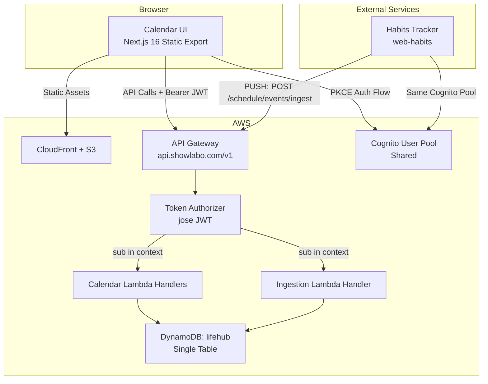

# Design Document: web-schedule-calendar

## Overview

LifeHub エコシステムにおけるカレンダー機能のフルスタック実装設計。本アプリは既存の web-habits アプリと同一の技術スタックおよびインフラパターンを踏襲し、エコシステム内サービスのイベントを集約表示する「ハブ」として機能する。

**主要設計方針:**
- web-habits と同一の Next.js 16 (App Router) + Zustand + shadcn/ui 構成
- 既存 `lifehub` DynamoDB シングルテーブルに `EVENT#` SK プレフィックスで参加
- 既存 Token Authorizer（jose ベース JWT 検証）を共有
- Ingestion API は Calendar API と同一 API Gateway に配置し、Lambda 個別ハンドラで処理
- showlabo-auth パッケージによる PKCE 認証を再利用
- 静的エクスポート（`output: 'export'`）+ S3 + CloudFront ホスティング

## Architecture



**デプロイ構成:**
- フロントエンド: `apps/web-schedule/` → S3 + CloudFront（app.showlabo.com のサブパスまたは別サブドメイン）
- バックエンド: `infra/cdk/lambda/schedule/` → API Gateway `/schedule/*` パス配下
- Ingestion API: `POST /schedule/events/ingest` — 外部サービスが認証付きでイベントを PUSH

## Components and Interfaces

### Frontend Components

```mermaid
graph TD
    subgraph Pages
        P1[/ - Calendar Page]
        P2[/auth/callback - Auth Callback]
    end

    subgraph Layout
        L1[CalendarLayout]
        L2[AuthGuard]
        L3[Header - ViewSwitcher + Navigation + Filters]
    end

    subgraph Calendar Views
        V1[MonthView]
        V2[WeekView]
        V3[DayView]
    end

    subgraph Shared
        S1[EventCard]
        S2[EventModal - Create/Edit]
        S3[SourceFilterPanel]
        S4[DeleteConfirmDialog]
        S5[NavigationControls]
    end

    subgraph Stores
        ST1[eventStore - Zustand]
        ST2[viewStore - Zustand]
        ST3[filterStore - Zustand + localStorage]
    end

    P1 --> L2
    L2 --> L1
    L1 --> L3
    L1 --> V1
    L1 --> V2
    L1 --> V3
    V1 --> S1
    V2 --> S1
    V3 --> S1
    S1 --> S2
    S1 --> S4
    L3 --> S3
    L3 --> S5
```

### Frontend Directory Structure

```
apps/web-schedule/
├── src/
│   ├── app/
│   │   ├── layout.tsx          # Root layout with providers
│   │   ├── page.tsx            # Calendar main page (AuthGuard)
│   │   ├── auth/
│   │   │   └── callback/
│   │   │       └── page.tsx    # OAuth callback handler
│   │   └── globals.css
│   ├── components/
│   │   ├── calendar/
│   │   │   ├── MonthView.tsx
│   │   │   ├── WeekView.tsx
│   │   │   ├── DayView.tsx
│   │   │   ├── EventCard.tsx
│   │   │   └── NavigationControls.tsx
│   │   ├── events/
│   │   │   ├── EventModal.tsx
│   │   │   └── DeleteConfirmDialog.tsx
│   │   ├── filters/
│   │   │   └── SourceFilterPanel.tsx
│   │   └── layout/
│   │       ├── CalendarLayout.tsx
│   │       ├── Header.tsx
│   │       └── AuthGuard.tsx
│   ├── lib/
│   │   ├── api-client.ts       # Reuse pattern from web-habits
│   │   ├── auth.ts             # showlabo-auth setup
│   │   ├── env.ts              # Environment variables
│   │   ├── date-utils.ts       # date-fns helpers
│   │   ├── source-colors.ts    # Source → color mapping
│   │   └── validators.ts       # Zod schemas for events
│   ├── stores/
│   │   ├── event-store.ts      # Event CRUD + fetch
│   │   ├── view-store.ts       # Current view + date
│   │   └── filter-store.ts     # Source filter state + localStorage
│   ├── types/
│   │   └── index.ts            # CalendarEvent, ViewType, etc.
│   └── test/
│       └── ...
├── public/
├── next.config.ts
├── package.json
├── tsconfig.json
└── vitest.config.ts
```

### Backend Lambda Structure

```
infra/cdk/lambda/schedule/
├── events/
│   ├── list.ts                 # GET /schedule/events?start=&end=
│   ├── create.ts               # POST /schedule/events
│   ├── update.ts               # PUT /schedule/events/{eventId}
│   └── delete.ts               # DELETE /schedule/events/{eventId}
└── ingest/
    └── create.ts               # POST /schedule/events/ingest
```

### API Endpoints

| Method | Path | Description | Auth |
|--------|------|-------------|------|
| GET | `/schedule/events?start={ISO}&end={ISO}` | 指定期間のイベント一覧取得 | JWT (sub) |
| POST | `/schedule/events` | ネイティブイベント作成 | JWT (sub) |
| PUT | `/schedule/events/{eventId}` | ネイティブイベント更新 | JWT (sub) |
| DELETE | `/schedule/events/{eventId}` | ネイティブイベント削除 | JWT (sub) |
| POST | `/schedule/events/ingest` | 外部イベント受信（Ingestion API） | JWT (sub) |

### API Request/Response Schemas

**POST /schedule/events (Create)**
```json
// Request
{
  "title": "Meeting",           // required, max 100 chars
  "startAt": "2026-07-01T10:00:00+09:00",  // required, ISO 8601
  "endAt": "2026-07-01T11:00:00+09:00",    // optional, ISO 8601
  "allDay": false               // optional, default false
}

// Response 201
{
  "data": {
    "id": "uuid-v4",
    "title": "Meeting",
    "startAt": "2026-07-01T10:00:00+09:00",
    "endAt": "2026-07-01T11:00:00+09:00",
    "allDay": false,
    "source": "native",
    "sourceEventId": null,
    "syncDirection": "read-only",
    "createdAt": "2026-07-01T09:00:00.000Z",
    "updatedAt": "2026-07-01T09:00:00.000Z"
  }
}
```

**GET /schedule/events?start=&end=**
```json
// Response 200
{
  "data": [
    {
      "id": "uuid-v4",
      "title": "Meeting",
      "startAt": "2026-07-01T10:00:00+09:00",
      "endAt": "2026-07-01T11:00:00+09:00",
      "allDay": false,
      "source": "native",
      "sourceEventId": null,
      "syncDirection": "read-only",
      "createdAt": "...",
      "updatedAt": "..."
    }
  ]
}
```

**POST /schedule/events/ingest (Ingestion API)**
```json
// Request
{
  "userId": "cognito-sub-uuid",      // required, must match JWT sub
  "title": "習慣完了: 朝の運動",       // required, max 200 chars
  "startTime": "2026-07-01T06:00:00+09:00",  // required, ISO 8601
  "endTime": "2026-07-01T06:30:00+09:00",    // optional, ISO 8601
  "source": "habit-tracker",          // required, max 50 chars, [a-z0-9-]
  "sourceEventId": "hlog-abc123-2026-07-01",  // required, max 128 chars
  "allDay": false                     // optional, default false
}

// Response 201 (new) or 200 (upsert)
{
  "data": {
    "id": "uuid-v4",
    "title": "習慣完了: 朝の運動",
    "startAt": "2026-07-01T06:00:00+09:00",
    "endAt": "2026-07-01T06:30:00+09:00",
    "allDay": false,
    "source": "habit-tracker",
    "sourceEventId": "hlog-abc123-2026-07-01",
    "syncDirection": "read-only",
    "createdAt": "...",
    "updatedAt": "..."
  }
}

// Response 400 (validation error)
{
  "error": {
    "code": "VALIDATION_ERROR",
    "message": "Validation failed",
    "details": [
      { "field": "title", "reason": "required" },
      { "field": "source", "reason": "must match pattern [a-z0-9-]" }
    ]
  }
}

// Response 403 (userId mismatch)
{
  "error": {
    "code": "FORBIDDEN",
    "message": "userId does not match authenticated user"
  }
}
```

### State Management Design

```typescript
// stores/event-store.ts
interface EventStore {
  events: CalendarEvent[];
  loading: boolean;
  error: string | null;
  fetchEvents: (start: string, end: string) => Promise<void>;
  createEvent: (input: CreateEventInput) => Promise<CalendarEvent>;
  updateEvent: (id: string, input: UpdateEventInput) => Promise<void>;
  deleteEvent: (id: string) => Promise<void>;
}

// stores/view-store.ts
interface ViewStore {
  viewType: 'month' | 'week' | 'day';
  currentDate: Date;  // anchor date for the current view
  setViewType: (type: ViewType) => void;
  navigateForward: () => void;
  navigateBackward: () => void;
  goToToday: () => void;
}

// stores/filter-store.ts
interface FilterStore {
  filters: Record<string, boolean>;  // source → enabled
  loadFilters: (sources: string[]) => void;
  toggleFilter: (source: string) => void;
  getVisibleEvents: (events: CalendarEvent[]) => CalendarEvent[];
}
```

**Filter Store の localStorage 永続化:**
- キー: `lifehub:schedule:source-filters`
- 値: `Record<string, boolean>` の JSON
- 新規 source 検出時: デフォルト ON で追加
- localStorage 読み込み失敗時: 全 ON で初期化

## Data Models

### DynamoDB Single Table Design

**テーブル: `lifehub`** （既存テーブルに追加）

| Attribute | Type | Description |
|-----------|------|-------------|
| pk | String | `USER#{userId}` |
| sk | String | `EVENT#{eventId}` |
| id | String | UUID v4 |
| title | String | イベントタイトル（native: max 100, external: max 200） |
| startAt | String | ISO 8601 開始日時 |
| endAt | String | ISO 8601 終了日時（nullable） |
| allDay | Boolean | 終日フラグ |
| source | String | `native` \| `habit-tracker` \| `[a-z0-9-]{1,64}` |
| sourceEventId | String \| null | 外部イベント ID（native は null） |
| syncDirection | String | `read-only`（MVP 固定） |
| GSI1PK | String | `USER#{userId}#SOURCE#{source}` |
| GSI1SK | String | ISO 8601 startAt 値 |
| createdAt | String | ISO 8601 作成日時 |
| updatedAt | String | ISO 8601 更新日時 |

### GSI Design

**GSI1（Source-Date Index）:**
- Partition Key: `GSI1PK` = `USER#{userId}#SOURCE#{source}`
- Sort Key: `GSI1SK` = `startAt` (ISO 8601)
- 用途: ユーザー × ソース × 日付範囲クエリ

### Access Patterns

| Pattern | Table/GSI | Key Condition |
|---------|-----------|---------------|
| ユーザーの全イベント取得（期間指定） | Main Table | pk = `USER#{userId}`, sk begins_with `EVENT#` + filter on startAt/endAt range |
| ユーザーのソース別イベント取得 | GSI1 | GSI1PK = `USER#{userId}#SOURCE#{source}`, GSI1SK between start and end |
| 単一イベント取得 | Main Table | pk = `USER#{userId}`, sk = `EVENT#{eventId}` |
| 冪等性チェック（Ingestion upsert） | GSI1 | GSI1PK = `USER#{userId}#SOURCE#{source}`, filter sourceEventId = value |

**期間クエリの実装方針:**
- メインテーブルの `sk` は `EVENT#{eventId}` のため、日付範囲フィルタリングは FilterExpression で行う
- 1 ヶ月分のイベント数が数百件を超えない前提（個人利用）のため、Scan コスト許容
- 大量イベント対応が必要になった場合は GSI1 を活用

### Ingestion Upsert Logic

冪等性保証のため、Ingestion API は以下のロジックで upsert を実行:

1. GSI1 で `USER#{userId}#SOURCE#{source}` をクエリし、`sourceEventId` で既存イベントを検索
2. 既存イベントが見つかった場合: UpdateCommand で上書き → HTTP 200
3. 既存イベントが見つからない場合: PutCommand で新規作成 → HTTP 201

### TypeScript Type Definitions

```typescript
// types/index.ts
export type ViewType = 'month' | 'week' | 'day';
export type SyncDirection = 'read-only' | 'bidirectional';

export interface CalendarEvent {
  id: string;
  title: string;
  startAt: string;       // ISO 8601
  endAt: string | null;  // ISO 8601, null for open-ended
  allDay: boolean;
  source: string;
  sourceEventId: string | null;
  syncDirection: SyncDirection;
  createdAt: string;
  updatedAt: string;
}

export interface CreateEventInput {
  title: string;
  startAt: string;
  endAt?: string;
  allDay?: boolean;
}

export interface UpdateEventInput {
  title?: string;
  startAt?: string;
  endAt?: string | null;
  allDay?: boolean;
}

export interface IngestEventInput {
  userId: string;
  title: string;
  startTime: string;
  endTime?: string;
  source: string;
  sourceEventId: string;
  allDay?: boolean;
}
```

## Correctness Properties

*A property is a characteristic or behavior that should hold true across all valid executions of a system — essentially, a formal statement about what the system should do. Properties serve as the bridge between human-readable specifications and machine-verifiable correctness guarantees.*

### Property 1: Event placement in correct time slot

*For any* calendar event with a given `startAt` datetime and any view type (month/week/day), the event SHALL appear in the cell or time slot that corresponds to its `startAt` date and time.

**Validates: Requirements 2.3, 2.4, 2.5**

### Property 2: Navigation date arithmetic

*For any* current date and view type, navigating forward then backward (or vice versa) SHALL return to the original date. Additionally, navigating forward by one unit SHALL shift the anchor date by exactly 1 month (month view), 7 days (week view), or 1 day (day view).

**Validates: Requirements 2.6**

### Property 3: Native event creation round-trip

*For any* valid event input (non-empty title ≤ 100 chars, valid ISO 8601 startAt, endAt ≥ startAt if provided), creating an event via the Calendar API SHALL persist it with `source = "native"`, `sourceEventId = null`, `syncDirection = "read-only"`, and a valid UUID `id`. Fetching events for the same user and time range SHALL return the created event with identical field values.

**Validates: Requirements 3.2, 3.4, 10.1, 10.3**

### Property 4: Event validation rejects invalid input

*For any* event input where title is empty/whitespace-only OR title exceeds 100 characters OR endAt is before startAt, the Calendar API and UI validation SHALL reject the input without modifying the Event Store.

**Validates: Requirements 3.5, 4.6**

### Property 5: Event deletion removes from store

*For any* native event that exists in the Event Store, after deletion via the Calendar API, querying for that event SHALL return no result.

**Validates: Requirements 4.4**

### Property 6: External events are immutable via Calendar API

*For any* event where `source !== "native"`, the Calendar API SHALL reject update and delete operations, returning an error response.

**Validates: Requirements 4.5**

### Property 7: Ingestion round-trip with source preservation

*For any* valid Ingestion_Schema payload, the Ingestion API SHALL persist the event with the exact `source` and `sourceEventId` values from the request. Fetching events for the authenticated user SHALL return the ingested event with those fields intact.

**Validates: Requirements 5.1, 5.2**

### Property 8: Ingestion schema validation rejects invalid payloads

*For any* ingestion request missing required fields (title, startTime, source, sourceEventId) OR exceeding field limits (title > 200, source > 50, sourceEventId > 128) OR with invalid source format, the Ingestion API SHALL return HTTP 400 with field-level error details.

**Validates: Requirements 5.3, 5.7**

### Property 9: Ingestion userId mismatch yields 403

*For any* ingestion request where the `userId` field does not equal the JWT `sub` claim, the Ingestion API SHALL return HTTP 403 and NOT persist the event.

**Validates: Requirements 5.5**

### Property 10: Ingestion idempotent upsert

*For any* valid ingestion payload sent twice with the same `source` and `sourceEventId`, the Event Store SHALL contain exactly one event for that (source, sourceEventId) pair, and the second call SHALL return HTTP 200. The stored event SHALL reflect the most recent payload values.

**Validates: Requirements 5.6**

### Property 11: Source filter correctness

*For any* set of events and any filter state (mapping of source → boolean), the visible events SHALL equal exactly the events whose source maps to `true` in the filter state. Toggling a source OFF then ON SHALL restore the original visible set.

**Validates: Requirements 6.2, 6.3**

### Property 12: Filter state persistence round-trip

*For any* filter state (Record<string, boolean>), saving to localStorage and then loading SHALL produce an equivalent state. New sources not present in the saved state SHALL default to `true` (ON).

**Validates: Requirements 6.5, 6.6, 6.7, 6.8**

### Property 13: User data isolation

*For any* two distinct authenticated users (distinct `sub` values), API requests from user A SHALL never return or modify events belonging to user B. The Calendar API SHALL derive the data access key exclusively from the JWT `sub` claim.

**Validates: Requirements 7.3, 7.4**

### Property 14: Source format validation

*For any* string used as a `source` value, it SHALL be accepted only if it matches the pattern `^[a-z0-9-]{1,64}$`. Any string not matching this pattern SHALL be rejected during event creation or ingestion.

**Validates: Requirements 10.6**

## Error Handling

### Frontend Error Handling Strategy

| Scenario | Behavior |
|----------|----------|
| API 401 (token expired) | `api-client.ts` が自動で `auth.refreshToken()` → 1 回リトライ → 失敗時 `auth.login()` へリダイレクト |
| API 403 (forbidden) | エラーメッセージ表示（「アクセス権限がありません」） |
| API 400 (validation) | フィールドレベルエラーをモーダル/フォームに表示 |
| API 500 (server error) | 汎用エラーメッセージ + sonner toast 通知 |
| Network error | 「ネットワークエラーが発生しました。接続を確認してください。」toast 表示 |
| Auth callback error | エラーページ表示（「認証に失敗しました。再度ログインしてください。」） |
| localStorage 読み込み失敗 | フィルター全 ON で初期化（サイレントフォールバック） |

### Backend Error Handling Strategy

| Scenario | HTTP Status | Response |
|----------|-------------|----------|
| Missing/invalid JWT | 401 | `{ error: { code: "UNAUTHORIZED", message: "..." } }` |
| userId mismatch (Ingestion) | 403 | `{ error: { code: "FORBIDDEN", message: "..." } }` |
| Cross-user resource access | 403 | `{ error: { code: "FORBIDDEN", message: "..." } }` |
| Validation failure | 400 | `{ error: { code: "VALIDATION_ERROR", message: "...", details: [...] } }` |
| Event not found | 404 | `{ error: { code: "NOT_FOUND", message: "..." } }` |
| Edit/delete external event | 403 | `{ error: { code: "FORBIDDEN", message: "Cannot modify external event" } }` |
| DynamoDB error | 500 | `{ error: { code: "INTERNAL_ERROR", message: "..." } }` |
| Unhandled exception | 500 | `{ error: { code: "INTERNAL_ERROR", message: "An unexpected error occurred" } }` |

**エラーレスポンスは既存の `common.ts` の `errorResponse()` ヘルパーを使用。**

### Optimistic UI Pattern

- **Create**: モーダル閉じ → ローカルに仮追加 → API 成功で確定 / 失敗でロールバック + エラー toast
- **Update**: ローカルに即反映 → API 成功で updatedAt 更新 / 失敗でロールバック + エラー toast
- **Delete**: ローカルから即除去 → API 成功で確定 / 失敗でロールバック + エラー toast

## Version Management

zeroRun プロジェクト（`D:\AI\SideWork\games\web\zeroRun`）と同じ方式を採用する。

**方式:** `npm version patch --no-git-tag-version` をビルドスクリプトに組み込み、ビルド毎に patch バージョンを自動インクリメント。

```json
// package.json scripts
{
  "build": "npm version patch --no-git-tag-version && next build"
}
```

**初期バージョン:** `0.1.0`

**特徴:**
- git tag は作成しない（`--no-git-tag-version`）
- ビルド実行時に自動で `package.json` の `version` フィールドが +1 される
- デプロイ済みアセットのバージョン追跡が可能

---

## web-habits 側の対応リスト

web-schedule-calendar の MVP 実現にあたり、web-habits 側で必要な対応を以下にまとめる。

| # | 対応内容 | 概要 | 優先度 |
|---|----------|------|--------|
| 1 | **Ingestion API への PUSH 実装** | 習慣記録完了時に `POST /schedule/events/ingest` へイベントを送信する。送信データは Ingestion_Schema 準拠（title, startTime, source="habit-tracker", sourceEventId=`hlog-{habitId}-{date}`）。認証は既存 Cognito JWT を流用。 | 必須（MVP） |
| 2 | **PUSH 送信の非同期化・失敗許容** | カレンダー API の障害時にも習慣記録自体は正常完了させる。送信失敗時はサイレントに無視（ログのみ）。将来的にリトライキューを検討。 | 必須（MVP） |
| 3 | **バージョン管理の統一** | web-schedule と同様に `npm version patch --no-git-tag-version` を build スクリプトに追加し、LifeHub エコシステム内でバージョン管理方式を統一する。 | 推奨 |
| 4 | **sourceEventId の生成ルール** | HabitLog 作成時に `hlog-{habitId}-{date}` 形式の一意キーを生成し、Ingestion API の冪等性保証に使用する。同日に同一習慣の再記録があった場合は同一 sourceEventId で上書き（upsert）される。 | 必須（MVP） |
| 5 | **Ingestion API エンドポイント URL の設定** | 環境変数 `SCHEDULE_INGEST_URL` を追加し、`https://api.showlabo.com/v1/schedule/events/ingest` を設定する。 | 必須（MVP） |

---

## Testing Strategy

### Property-Based Testing (PBT)

**ライブラリ:** [fast-check](https://github.com/dubzzz/fast-check) (vitest 統合)

PBT は以下のレイヤーに適用:
- **バリデーションロジック** (validators.ts): イベント入力検証、source フォーマット検証
- **日付計算ロジック** (date-utils.ts): ナビゲーション、イベント配置
- **フィルターロジック** (filter-store.ts): ソースフィルタリング、localStorage 永続化
- **API ハンドラロジック** (Lambda): 冪等性、ユーザー分離、スキーマ検証

**設定:**
- 各プロパティテスト: 最低 100 回のイテレーション
- タグ形式: `Feature: web-schedule-calendar, Property {N}: {property_text}`

### Unit Tests (Example-Based)

| 対象 | テスト内容 |
|------|-----------|
| AuthGuard | 未認証時のリダイレクト |
| EventModal | 作成/編集モーダルの表示・バリデーション表示 |
| MonthView/WeekView/DayView | 正しいグリッド構造のレンダリング |
| API handlers | 正常系レスポンス、エラーケース |
| Ingestion handler | 201/200/400/403 の各シナリオ |

### Integration Tests

| 対象 | テスト内容 |
|------|-----------|
| Authorizer | JWT 検証の正常/異常系 |
| DynamoDB 操作 | CRUD + GSI クエリの実行確認 |
| API Gateway | CORS ヘッダー、Gateway Response |

### Testing Tools

- **Frontend**: vitest + @testing-library/react + jsdom
- **PBT**: fast-check
- **Backend**: vitest (Lambda ハンドラ単体テスト)
- **E2E (将来)**: Playwright

### Test File Structure

```
apps/web-schedule/src/test/
├── properties/
│   ├── date-utils.property.test.ts    # Property 1, 2
│   ├── validators.property.test.ts    # Property 4, 8, 14
│   ├── filter-store.property.test.ts  # Property 11, 12
│   └── event-store.property.test.ts   # Property 3, 5, 6
infra/cdk/lambda/schedule/test/
├── properties/
│   ├── ingest.property.test.ts        # Property 7, 9, 10
│   └── user-isolation.property.test.ts # Property 13
├── events/
│   ├── create.test.ts
│   ├── update.test.ts
│   ├── delete.test.ts
│   └── list.test.ts
└── ingest/
    └── create.test.ts
```
